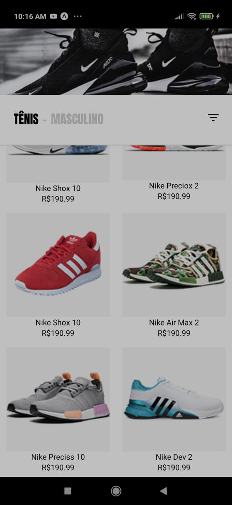
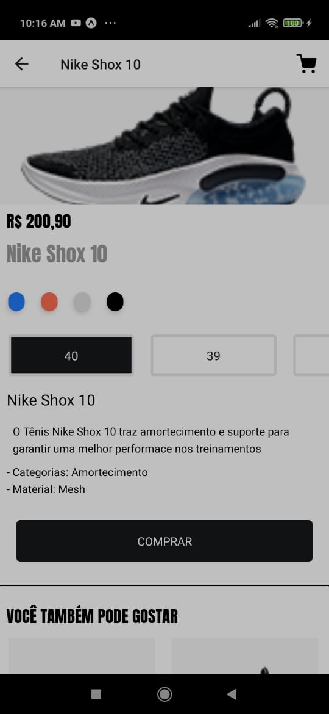
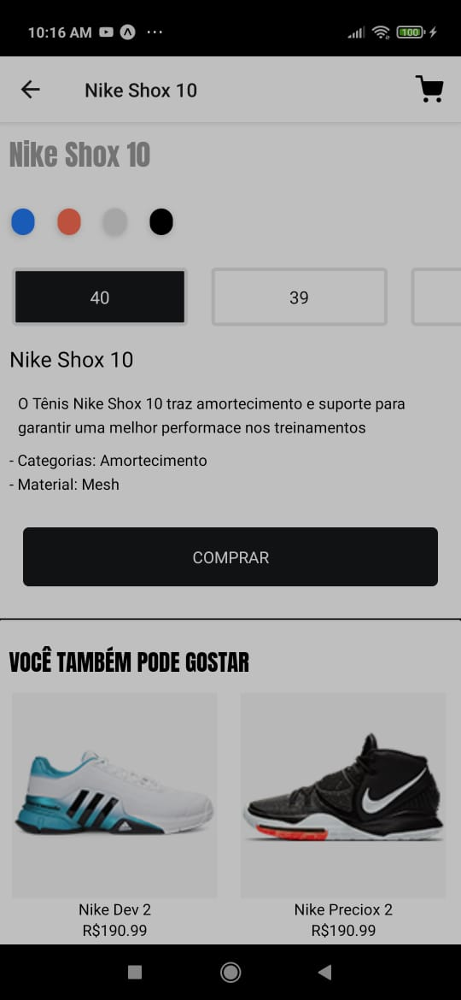

<h1 align="center">
  Layout Loja de Tênis
</h1>
<h3 align="center"></h3>

Projeto desenvolvido para treinar o desenvolvimento de layouts com React Native

<h4 align="center">
	🚧  Próximo nível 🚀 Pegando xp...  🚧
</h4>

<h2> 🛠 Tecnologias </h2>

Essas foram as ferramentasusadas na implementação desse projeto:

- [React Native](https://reactnative.dev/)
- [TypeScript](https://www.typescriptlang.org/)

<h2> 🛠 Libs  </h2>

Algmas libs utilizadas no projeto:

- React Navigation
  - Stack
- Expo (framework Rn)
  - Vector Icons
  - Expo Fonts

<h2>Visão geral do projeto</h2>

- Home e Detalhes do produto

  
  
  

<h2>Igor Monteiro</h2>

obs: nomes e preços meramente ilustrativos

Feito com todo foco possível...
